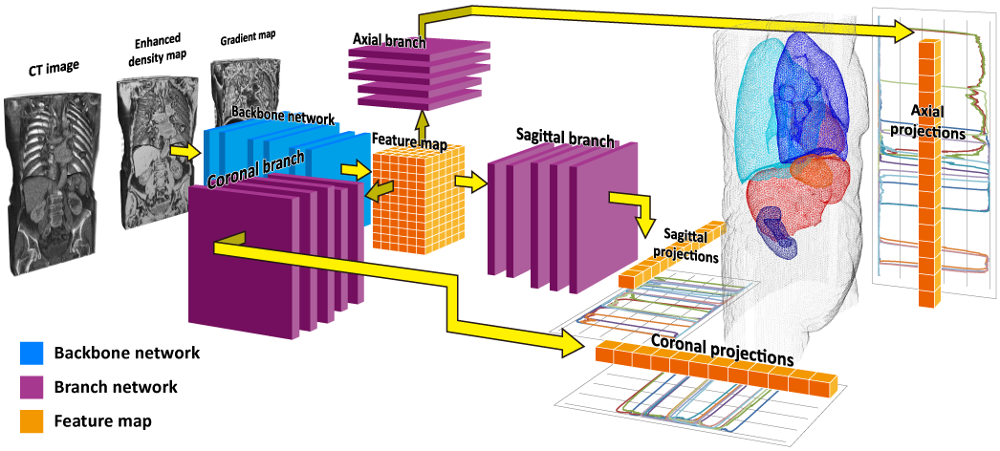
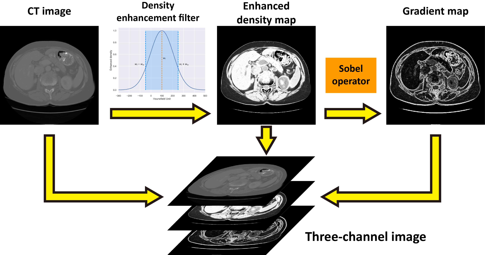

# Triple-Branch FCN for Multiple Organ Localization in CT Images

This is a C++ ([Caffe](https://github.com/BVLC/caffe)) implementation of **Triple-Branch Fully Convolutional Networks** method for multiple organ localization in computed tomography (CT) images proposed in our ***IEEE Access*** journal paper [**"Multiple Organ Localization in CT Image Using Triple-Branch Fully Convolutional Networks"**](https://doi.org/10.1109/ACCESS.2019.2930417).

The code has been compiled and passed on `Windows 7 (64 bits)` using `Visual Studio 2013`.

## Citation
  *X. Xu, F. Zhou, B. Liu and X. Bai, "Multiple Organ Localization in CT Image Using Triple-Branch Fully Convolutional Networks," in IEEE Access, vol. 7, pp. 98083-98093, 2019, doi: 10.1109/ACCESS.2019.2930417.*

    @article{Xu2019TBFCN,
      title={Multiple Organ Localization in CT Image Using Triple-Branch Fully Convolutional Networks}, 
      author={Xu, Xuanang and Zhou, Fugen and Liu, Bo and Bai, Xiangzhi},
      journal={IEEE Access}, 
      year={2019},
      volume={7},
      number={},
      pages={98083-98093},
      doi={10.1109/ACCESS.2019.2930417}
    }

## Abstract
Organ localization is an essential prerequisite for many computed tomography (CT) image analysis tasks such as organ segmentation, lesion detection, and image registration. However, it is a challenging problem due to various causes such as the low-contrast organ boundaries, the large variations of organ appearance, the truncated organs, and the abnormalities. In this work, we propose an automatic method for multiple organ localization in CT image using a novel triple-branch fully convolutional network (FCN). First, the input CT image is extended to a three-channel image that contains both the original image and the enhanced organ structures using a density enhancement filter. Then, the extended three-channel image is fed to a 3D triple-branch FCN to parallelly predict the organs' presence probability curves along axial, coronal and sagittal directions. Finally, the bounding boxes of the target organs are computed based on these presence probability curves. The triple-branch FCN is fully implemented in 3D manner, thus it can take full advantage of the spatial context information in CT image to perform accurate organ localization. Only several basic convolutional neural networks (ConvNet) operations (such as convolution, pooling and softmax regression) are involved in this triple-branch FCN, thus it is easy-implemented and flexible to serve as a preprocessing module in other medical image analysis tasks. By enhancing the structural information in the CT image using the density enhancement filter, the performance of the triple-branch FCN can be further improved. The proposed method is evaluated on a challenging public dataset with 201 clinical abdominal/torso CT images to locate 11 body organs. As the experimental results showed, the proposed method achieves higher localization accuracy than the current state-of-the-art methods.

## Method
### Scheme of Triple-Branch FCN


### Scheme of Three-Channel Image Generation


## How to build

**Requirements**: `Visual Studio 2013`, `ITK-4.10`, `CUDA 8.0` and `cuDNN v5`

### Pre-Build Steps
Please make sure CUDA and cuDNN have been installed correctly on your computer.

Clone the project by running:
```
git clone https://github.com/superxuang/caffe_triple-branch_FCN.git
```

In `.\Caffe.bat` set `ITK_PATH` to ITK intall path (the path containing ITK `include`,`lib` folders).

### Build
Run `.\Caffe.bat` and build the project `caffe` in `Visual Studio 2013`.

## How to use
### Download image data
Please download and unzip the CT images from [LiTS challenge](https://competitions.codalab.org/competitions/17094). Note that, the original CT images of LiTS dataset are stored in `*.nii` format. Please convert them to `*.mhd` format.

### Download annotation data
The organ bounding-box annotations could be downloaded from [this repository](./annotations_on_LiTS/) or [IEEE DataPort](http://dx.doi.org/10.21227/df8g-pq27).

### Prepare data
Move the CT images and the bounding-box annotations to a data folder, and create an entry list file (`_train_set_list.txt`) in the same folder. To this end, the data folder is organized in the folloing way:

```
└── data folder
    ├── _train_set_list.txt
    ├── volume-0.mhd
    ├── volume-0.raw
    ├── segmentation-0.mhd
    ├── segmentation-0.raw
    ├── segmentation-0.txt
    ├── volume-1.mhd
    ├── volume-1.raw
    ├── segmentation-1.mhd
    ├── segmentation-1.raw
    ├── segmentation-1.txt
    |   ....................... 
    ├── volume-130.mhd
    ├── volume-130.raw
    ├── segmentation-130.mhd
    ├── segmentation-130.raw
    └── segmentation-130.txt
```

The entry list file `_train_set_list.txt` stores the filenames that are actually used for training. Each line of the entry list file corresponds a data sample. Here is an example of the entry list file `_train_set_list.txt` corresponding to above data folder. **Note that, the segmentation mask file (`segmentation-N.mhd` and `segmentation-N.raw`) is not necessary for neither training nor testing. We just reserve it for further research (e.g. organ segmentation). You could just make the segmentation mask files absent and fill the second column of the entry list file with a non-existent filename.**  

```
volume-0.mhd segmentation-0.mhd segmentation-0.txt
volume-1.mhd segmentation-1.mhd segmentation-1.txt
.......................
volume-130.mhd segmentation-130.mhd segmentation-130.txt
```

### Start the training
Modify the path parameter of datalayer in `.\models\triple-branch_FCN\net.prototxt`.
```
layer {
  name: "mhd_input"
  type: "MHDRoiData"
  top: "data"
  top: "im_info"
  top: "label_a"
  top: "label_c"
  top: "label_s"
  mhd_data_param {  
    source: "F:/Deep/MyDataset/LITS/_train_set_list.txt" # the entry list file mentioned above  
    root_folder: "F:/Deep/MyDataset/LITS/" # the data folder mentioned above
    batch_size: 3
    shuffle: true
    hist_matching: false
    truncate_probability: 0.5
    min_truncate_length: 128
    inplane_shift: 5
    min_intensity: -1000
    max_intensity: 1600
    random_deform: 0.0
    deform_control_point: 2
    deform_sigma: 15.0
    contour_name_list {
      name: "liver"
      name: "lung-r"
      name: "lung-l"
      name: "kidney-r"
      name: "kidney-l"
      name: "femur-r"
      name: "femur-l"
      name: "bladder"
      name: "heart"
      name: "spleen"
      name: "pancreas"
    }
    resample_size_x: 256
    resample_size_y: 256
    resample_size_z: 512
  }
  include: { phase: TRAIN }
}
```
Run `.\models\triple-branch_FCN\train.bat`

## Contact
You are welcome to contact us:  
  - [superxuang@gmail.com](mailto:superxuang@gmail.com) ([Dr. Xuanang Xu](https://superxuang.github.io/))
